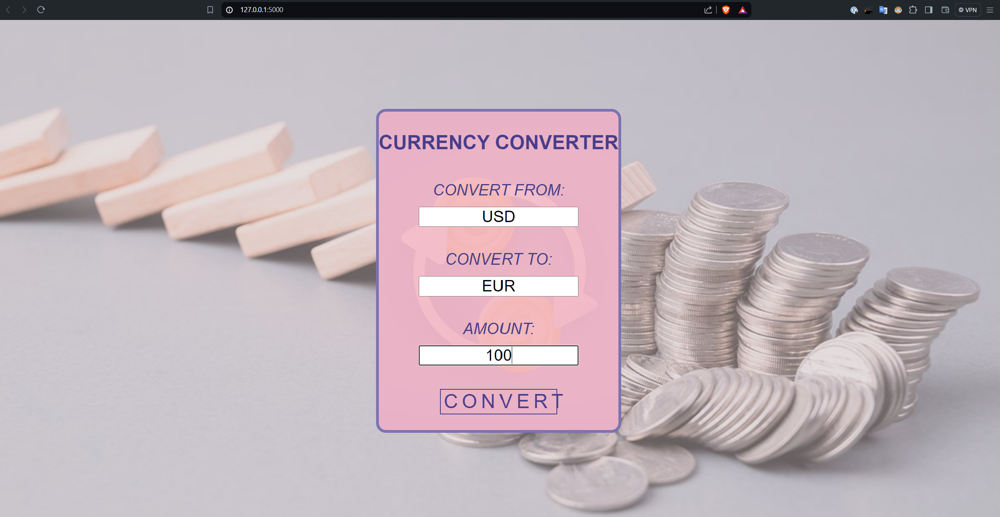

# Currency Converter Web Application

## Project Overview

This repository has the final version of a project submitted for the ReDI School of Digital Integration's course on Python Fundamentals. It is a Flask-based currency converter application that allows users to convert amounts between different currencies using the [Fixer API](https://apilayer.com/marketplace/fixer-api).

## Team Members
- Mohamed Ashik
- Milica Gareski
- Matheus Zago

## Project Description
The Currency Converter Web Application allows users to convert an amount from one currency to another using real-time exchange rates from the Fixer API. The application ensures that the input currencies are valid and provides the converted amount based on the current exchange rates. The project consists of three main Python files and an optional all-in-one file:

1. **currency_validation.py** - Validates the input currencies.
2. **amount_validation.py** - Validates the input amount.
3. **currency_converter.py** - Handles the currency conversion logic.
4. **main.py** - The main file that ties everything together and runs the Flask application.

Additionally, an **allinone.py** file is provided, which combines the functionality of the above three modules into a single script for convenience.

## Code Explanation

### Python Code
1. **Currency Validation Function**: 
   - Prompts the user to input the source and target currencies.
   - Checks the validity of these currencies using the Fixer API.
2. **Amount Validation**: 
   - Prompts the user to input the amount to be converted.
   - Ensures the amount is a valid positive number.
3. **Currency Conversion**: 
   - Constructs a URL with the source and target currencies, and the amount.
   - Sends a GET request to the Fixer API to retrieve the converted amount.
   - Displays the result to the user.


### Prerequisites
The required packages for this project are listed in the requirements.txt file.
Bellow are the libraries that you will have to install. 

- Python 3.x
- Flask
- Requests

# Check how to deploy our app.

### Installation

1. Clone the repository:

    ```bash
    git clone https://github.com/ashik12102/Python_Currency_Converter.git
    cd Python_Currency_Converter
    ```

2. Install the required packages:

    ```bash
    pip install -r requirements.txt
    ```

3. Set up your API key:

    - Sign up for an API key from [Fixer](https://apilayer.com/marketplace/fixer-api).
    - Replace the placeholder API keys in `currency_validation.py`, `currency_converter.py`, and `allinone.py` with your actual API key.

### Running the Application

To run the application, you can choose either the modular approach with `main.py` or the all-in-one approach with `allinone.py`.

#### Using main.py

1. Ensure the `main.py`, `currency_validation.py`, `amount_validation.py`, and `currency_converter.py` files are in the same directory.
2. Run the Flask application:

    ```bash
    python main.py
    ```

3. Open your browser and navigate to `http://127.0.0.1:5000`.

#### Using allinone.py

1. Ensure the `allinone.py` file is in your project directory.
2. Run the Flask application:

    ```bash
    python allinone.py
    ```

3. Open your browser and navigate to `http://127.0.0.1:5000`.

### Usage

1. Enter the source currency code (e.g., USD).
2. Enter the target currency code (e.g., EUR).
3. Enter the amount to convert.
4. Click on the "Convert" button to see the conversion result.



This project is a collaborative effort demonstrating the integration of Python for backend processing and HTML/CSS for frontend design.

